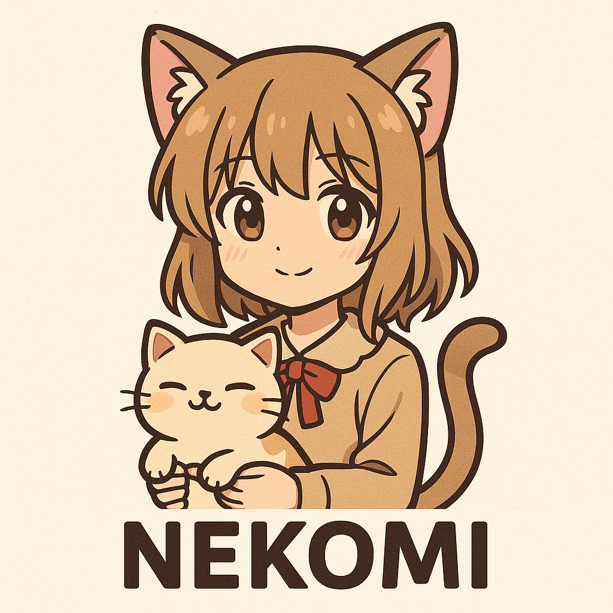

<div align="center">
  
</div>

# Nekomi Discord Bot

[](https://nodejs.org/)
[](https://pnpm.io/)
[](https://www.typescriptlang.org/)
[](LICENSE)
[](https://prettier.io/)

Nekomi is a cute Discord bot that delivers a random cat picture or gif every day, straight to your channel. Just type !cat for an instant cat delivery, or let it automatically send one daily! Perfect for adding some daily cuteness to your server. 🐾

## Features

- **Daily Cat Drops:** Schedules and posts a random cat image every day at 9:00 AM.
- **Slash Commands:**
  - `/nekoschedule` — Schedules daily cat drops.
  - `/neko` — Custom neko command.
  - `/setnekoschedulechannel` — Set the channel for the daily Neko schedule.
  - `/removenekoschedulechannel` — Remove the channel for the daily Neko schedule.
- **Written in TypeScript** for type safety and maintainability.
- **Prettier** for consistent code style.

## Getting Started

### Prerequisites

- [Node.js](https://nodejs.org/) (v18+ recommended)
- [pnpm](https://pnpm.io/) (used for dependency management)

### Installation

```bash
pnpm install
```

### Environment Variables

Create a `.env` file in the root directory with the following:

```env
DISCORD_TOKEN=your-bot-token-here
SUPABASE_URL=your-supabase-url
SUPABASE_KEY=your-supabase-anon-key
```

### Persistent Storage: Supabase

Nekomi now uses [Supabase](https://supabase.com/) for all persistent storage. You **do not need SQLite** or any local database files.

#### Supabase Setup

1. **Create a free Supabase project** at [https://supabase.com/](https://supabase.com/).
2. **Create the required table** using the SQL editor:

   ```sql
   create table if not exists public.guild_channels (
     guild_id text primary key,
     channel_id text not null
   );
   ```

3. **Get your project credentials:**
   - `SUPABASE_URL` (Project URL)
   - `SUPABASE_KEY` (Anon public key)
4. **Add these to your `.env` file** as shown above.

**Note:** No local database file will be created or used. All schedule channel data is stored securely in your Supabase database.

### Scripts

- `pnpm start` — Run the bot in development mode
- `pnpm format` — Format the codebase with Prettier
- `pnpm format:check` — Check code formatting

### Running the Bot

```bash
pnpm start
```

## Running on VPS

To run the Nekomi bot on a VPS or production server, it is recommended to use [PM2](https://pm2.keymetrics.io/) as a process manager. PM2 ensures your bot stays online, restarts on failure, and manages logs efficiently.

Below is a sample `pm2.config.js` configuration for running the bot using the Bun runtime. This setup logs output and errors to the `./logs` directory and sets different environments for development and production.

```js
// pm2.config.js
module.exports = {
  apps: [
    {
      name: 'nekomi',
      script: './src/index.ts',
      instances: 1,
      exec_mode: 'fork',
      autorestart: true,
      watch: false,
      max_memory_restart: '480M',
      error_file: './logs/pm2-err.log',
      out_file: './logs/pm2-out.log',
      interpreter: 'bun', // Bun interpreter
      env: {
        NODE_ENV: 'development',
        WATCH: 'true',
        PATH: `${process.env.HOME}/.bun/bin:${process.env.PATH}`,
      },
      env_production: {
        NODE_ENV: 'production',
        WATCH: 'false',
      },
    },
  ],
};
```

## Contributing

Pull requests and issues are welcome! Please ensure code style is consistent by running Prettier before submitting.

## License

MIT
